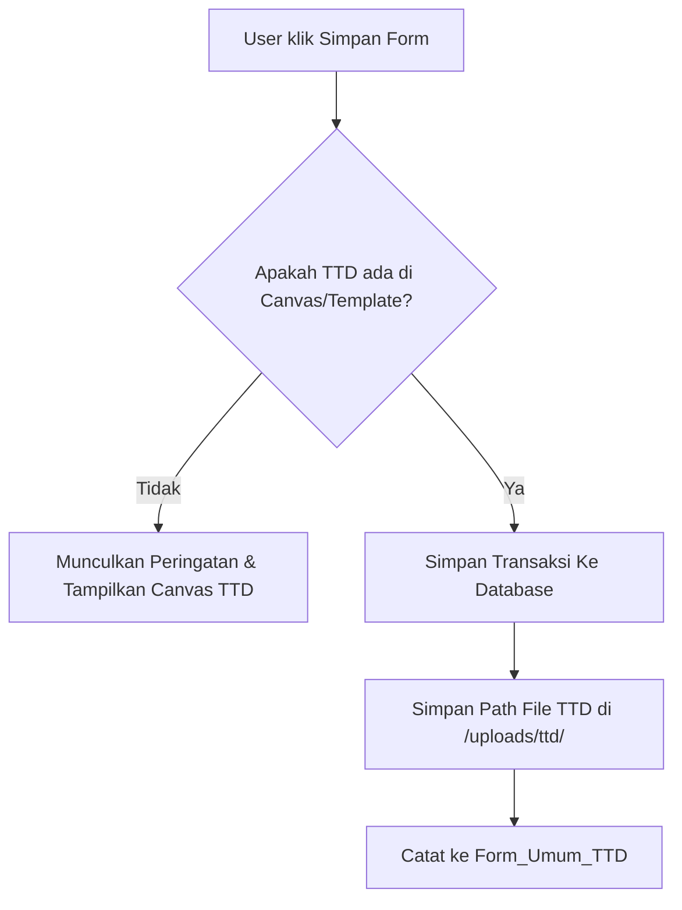

# Panduan Pengembang: Modul Form Umum
**Arsitektur, Alur Tanda Tangan, dan Panduan Penambahan Form Baru**

Dokumen ini menjelaskan struktur arsitektur modul `form_umum`, skema database, alur tanda tangan, penggunaan komponen terstandarisasi, dan panduan langkah demi langkah untuk menambahkan form baru di masa mendatang.

---

## 1. Struktur Folder & Arsitektur Modul

Modul `form_umum` terletak di dalam folder `pages/form_umum/` dengan struktur sebagai berikut:

```text
pages/form_umum/
├── form_contents/
│   ├── components/
│   │   ├── rejection_status.php   # Komponen penanganan status penolakan form
│   │   └── signature_canvas.php   # Komponen canvas tanda tangan dinamis
│   └── form_buka_tanggal_closingan.php # Halaman input & edit form Buka Tanggal Closingan
├── db_migration.sql               # Skrip inisialisasi tabel database modul Umum
├── list_form.php                  # Halaman utama (Master/Inbox)
├── list_form_serverside.php       # Data processor server-side untuk DataTables list_form
├── load_form.php                  # Handler memuat halaman input form (simpan/edit)
├── load_data.php                  # Handler memuat data form untuk dibaca/diedit
├── proses_simpan.php              # Handler penyimpanan form baru
├── proses_update.php              # Handler pembaruan data form
├── proses_delete.php              # Handler penghapusan data form
├── detail_buka_tanggal_closingan.php # Halaman detail & persetujuan form
├── generate_pdf_buka_tanggal_closingan.php # Generator PDF untuk cetak dokumen
├── ttd_user.php                   # Halaman manajemen template tanda tangan pengguna
├── ttd_sign.php                   # Handler penandatanganan dokumen (menggunakan template)
├── ttd_save_template.php          # Handler penyimpanan TTD ke template sekaligus dokumen
├── delete_ttd.php                 # Handler penghapusan tanda tangan pada dokumen
├── get_ttd_count.php              # Handler real-time status tanda tangan dan persetujuan
└── proses_reject.php              # Handler penolakan form oleh atasan/direksi
```

---

## 2. Struktur Tabel Database

Modul `form_umum` menggunakan 3 tabel utama yang terpisah dari modul IT untuk menghindari pencampuran data hak akses dan transaksi.

1.  **`User_TTD_Template_Umum`**
    Menyimpan template tanda tangan pengguna berdasarkan `EmpId` (Karyawan) dan `GroupRole` (Peran dalam persetujuan).
2.  **`Form_Umum_TTD`**
    Menyimpan riwayat tanda tangan digital yang dibubuhkan pada dokumen transaksi Umum. Menghubungkan tanda tangan dengan nomor tiket (`ticket`), urutan tanda tangan (`urutan`), nama penandatangan (`nama`), serta path tanda tangan (`path_ttd`).
3.  **`Form_Umum_Buka_Tanggal_Closingan`**
    Tabel data transaksi pengajuan pembukaan tanggal closingan. Memiliki kolom pelacakan status (`status_ticket`), informasi penolak (`rejected_by`, `rejection_reason`, `rejection_date`), dan status tanda tangan masing-masing pihak (Pemohon, Atasan, Kabag IT, Direksi).

---

## 3. Komponen Standar (AIO Components)

Modul ini menggunakan komponen reusable yang terletak di subfolder `form_contents/components/`:

### A. Signature Canvas (`signature_canvas.php`)
Menyediakan antarmuka canvas tanda tangan interaktif (mendukung input mouse, touch screen, dan stylus). Komponen ini secara otomatis menangani:
- Pemilihan penandatanganan via template (jika sudah didaftarkan di `ttd_user.php`).
- Penggambaran langsung pada canvas.
- Penyimpanan template baru secara opsional saat penandatanganan dilakukan.
- Deteksi ketebalan tinta dan pembersihan latar belakang putih (transparansi PNG).

**Cara penggunaan pada Form Input:**
1. Sertakan file komponen di bagian bawah file form Anda:
   ```php
   <?php include 'components/signature_canvas.php'; ?>
   ```
2. Gunakan logic submit jQuery untuk mencegah form terkirim sebelum validasi tanda tangan selesai:
   ```javascript
   window._allowSubmit = false;
   $('#formAnda').on('submit', function(e){
       if (!window._allowSubmit) {
           e.preventDefault();
           if (!window._skipTTDCheckOnce) {
               if (typeof window.validateTTDBeforeSubmit === 'function') {
                   window.validateTTDBeforeSubmit().then(function(isSigned){
                       if (isSigned) {
                           window._allowSubmit = true;
                           $('#formAnda')[0].submit();
                       }
                   });
               } else {
                   window._allowSubmit = true;
                   $('#formAnda')[0].submit();
               }
           } else {
               window._allowSubmit = true;
               $('#formAnda')[0].submit();
           }
           return false;
       }
       window._allowSubmit = false;
       return true;
   });
   ```

### B. Rejection Status (`rejection_status.php`)
Menampilkan kotak informasi merah yang elegan apabila dokumen pengajuan ditolak, lengkap dengan nama penolak, alasan penolakan, dan tanggal penolakan.

---

## 4. Panduan Menambahkan Jenis Form Baru di Modul Umum

Jika Anda ingin membuat form pengajuan baru (misalnya *Form Pengantar Barang*, *Form Perizinan*, dll.) di dalam modul `form_umum`, ikuti langkah-langkah berikut:

### Langkah 1: Buat Tabel Transaksi Baru
Buat tabel baru di database, misalnya `Form_Umum_Pengantar_Barang`. Pastikan tabel tersebut memiliki kolom wajib berikut untuk integrasi dengan modul tanda tangan dan status pelacakan:
- `ticket` (VARCHAR, Primary Key) -> Contoh Prefix: `PGB-`
- `status_ticket` (VARCHAR)
- `rejected_by` (VARCHAR)
- `rejection_reason` (NVARCHAR)
- `rejection_date` (DATETIME)
- `created_at` (DATETIME)
- `created_by` (VARCHAR)
- Kolom persetujuan tanda tangan (misal: `ttd_pemohon`, `ttd_atasan`, dll. berupa INT/VARCHAR)

### Langkah 2: Buat Halaman Form Input & Detail
1. Buat file form input baru di `form_contents/form_pengantar_barang.php` (Gunakan `form_buka_tanggal_closingan.php` sebagai referensi).
2. Buat halaman detail transaksi baru di `detail_pengantar_barang.php`.
3. Buat file cetak PDF di `generate_pdf_pengantar_barang.php`.

### Langkah 3: Daftarkan Prefix Tiket & Logic Form Baru pada Backend Handler

#### A. Pada `load_form.php` & `load_data.php`
Daftarkan kondisi baru untuk memuat form berdasarkan parameter form id atau jenis tiket.

#### B. Pada `proses_simpan.php`, `proses_update.php`, & `proses_delete.php`
Tambahkan cabang `elseif` untuk menangani insert, update, dan delete pada tabel baru `Form_Umum_Pengantar_Barang`.

#### C. Pada `proses_reject.php`
Tambahkan penanganan penolakan untuk tabel baru:
```php
$isPGB = stripos($ticket, 'PGB-') === 0;
if ($isPGB) {
    $checkSql = "SELECT ticket, status_ticket FROM Form_Umum_Pengantar_Barang WHERE ticket = ?";
    // ...
    $updateSql = "UPDATE Form_Umum_Pengantar_Barang SET status_ticket = ?, rejected_by = ?, rejection_reason = ?, rejection_date = ? WHERE ticket = ?";
}
```

#### D. Pada `get_ttd_count.php`
Daftarkan prefix baru agar sistem tahu jumlah penandatangan wajib untuk form tersebut:
```php
$isPGB = stripos($ticket, 'PGB-') === 0;
// ...
} elseif ($isPGB) {
    $sqlStatus = "SELECT status_ticket FROM Form_Umum_Pengantar_Barang WHERE ticket = ?";
}
// ...
// Tentukan tipe tiket dan jumlah tanda tangan wajib
$ticketType = $isClosing ? 'Closingan' : ($isPGB ? 'Pengantar Barang' : 'Umum');
$required = $isClosing ? 4 : ($isPGB ? 3 : 4);
```

#### E. Integrasi Server-Side List (`list_form_serverside.php`) - **CRITICAL (UNION Query)**
Tabel master `list_form.php` menampilkan semua jenis dokumen umum dalam satu tabel terpadu. Agar form baru Anda muncul di daftar master, Anda harus menambahkan query `UNION ALL` di dalam `list_form_serverside.php`.

Cari query utama SQL di `list_form_serverside.php` lalu gabungkan tabel baru Anda:
```sql
SELECT 
    'Closingan' AS FormType,
    ticket,
    created_by,
    created_at,
    status_ticket,
    -- kolom lain ...
FROM Form_Umum_Buka_Tanggal_Closingan

UNION ALL

SELECT 
    'Pengantar Barang' AS FormType,
    ticket,
    created_by,
    created_at,
    status_ticket,
    -- kolom lain ...
FROM Form_Umum_Pengantar_Barang
```
Pastikan jumlah kolom dan tipe data pada query `UNION` tersebut sama persis agar database dapat memprosesnya dengan benar.

---

## 5. Alur Validasi Tanda Tangan (Signature Flow)



### Tips Tambahan Keamanan & Pemeliharaan:
*   **Ticket Prefix:** Gunakan prefix yang unik untuk setiap jenis form baru (misal: `CLS-` untuk Closingan, `PGB-` untuk Pengantar Barang) agar parser backend dapat mengidentifikasi jenis dokumen secara instan tanpa melakukan query database berulang kali.
*   **Penghapusan TTD:** Apabila template tanda tangan di `ttd_user.php` dihapus oleh administrator, sistem akan mencari referensi file gambar tersebut terlebih dahulu di seluruh kolom database terkait. Jika gambar masih terpakai pada dokumen pengajuan yang sudah diarsipkan, sistem secara otomatis akan memblokir penghapusan file gambar untuk mencegah kerusakan tampilan dokumen historis.

---

## 6. Checklist Aktual Saat Menambah Form Baru

Gunakan checklist ini agar tidak ada integrasi yang terlewat:

### A. Database
- Buat migration tabel transaksi baru.
- Pastikan kolom minimal tersedia:
  - `ticket`
  - `nama_pemohon`
  - `departemen`
  - `tgl_pengajuan`
  - `status_ticket`
  - `created_at`
  - `created_by`
- Jika form memakai QR scan, tambahkan kolom status scan seperti:
  - `jam_keluar_real`
  - `jam_kembali_real` atau `status_keluar` sesuai kebutuhan.

### B. Registrasi Form Input
- `load_form.php`: tambah mapping `form_type` ke file form.
- `list_form.php`: tambah item pilihan form di modal tambah form.
- `form_contents/form_nama_baru.php`: buat UI form.

### C. Backend Transaksi
Wajib cek dan tambah prefix form baru pada file berikut:

- `proses_simpan.php`
- `proses_update.php`
- `proses_delete.php`
- `proses_reject.php`
- `load_data.php`

### D. Approval / TTD
Tabel TTD global adalah `Form_Umum_TTD` dengan kunci:

- `Ticket`
- `GroupRole`
- `SignaturePath`

File yang wajib dicek:

- `get_ttd_count.php`
- `ttd_sign.php`
- `ttd_save_template.php`

Jika form baru auto-approved setelah TTD lengkap, tambahkan update status ke tabel transaksi form tersebut.

#### Template TTD Manual

- Template TTD manual untuk karyawan tanpa data `m_emp` disimpan di `User_TTD_Template_Umum` dengan:
  - `UserId = 0`
  - `UserName = nama manual`
  - `GroupRole = role tanda tangan`
- Hanya administrator (`GroupId = 1`) yang boleh memilih template manual saat menandatangani dokumen.
- Saat dokumen ditandatangani memakai template manual, `Form_Umum_TTD` wajib menyimpan:
  - `SignedByUserId = 0`
  - `SignedByUserName = nama manual`
  - `SignaturePath = path template manual`
- Detail page yang memakai `ttd_save_template.php` harus menyediakan pilihan admin:
  - pakai TTD akun sendiri; atau
  - pakai TTD manual aktif sesuai role.
- Endpoint standar untuk daftar TTD manual adalah `get_manual_ttd_templates.php`.

### E. List Master
`list_form_serverside.php` wajib diupdate pada bagian:

- Query `UNION ALL`.
- `roleCategoryMap`.
- Jumlah TTD wajib per kategori/prefix.
- Badge status.
- Routing PDF detail per tiket.
- Tombol QR jika form memakai scan.
- Filter `Jenis Report` di `list_form.php` jika form baru punya rekap PDF.
- Handler `#btnGeneratePdf` di `list_form.php` untuk routing ke file rekap baru.
- Dropdown `Status` harus dinamis berdasarkan `Jenis Report` yang dipilih:
  - Jika belum pilih jenis report: disabled dengan pesan "Pilih Jenis Report terlebih dahulu".
  - Jika `rekap_closingan`: Pending, Approved, Ditolak, Unclosing, Closed.
  - Jika `rekap_izin_keluar` atau `rekap_izin_pulang_cepat`: Pending, Approved, Ditolak.

#### Visibility Filtering & Role Isolation

**CRITICAL:** `list_form_serverside.php` menerapkan visibility filtering untuk non-admin agar user hanya melihat form yang relevan dengan role mereka.

**Aturan Visibility (baris ~200-297):**
1. **Admin (GroupId=1)**: Lihat semua form tanpa filter
2. **Owner**: User melihat form yang mereka buat (`created_by = current user`)
3. **Signed**: User melihat form yang sudah mereka tandatangani
4. **Pending Role**: User melihat form yang memerlukan role mereka DAN belum ditandatangani oleh siapa pun dengan role tersebut

**Isolasi Per-Penandatangan:**
Setelah satu user dengan role R men-TTD form, user lain dengan role R yang sama **TIDAK** lagi melihat form tersebut (kecuali mereka adalah owner atau sudah TTD).

**Role Requirement Check (Closingan):**
Untuk form Closingan, visibility filter wajib cek apakah role tersebut **memang diperlukan** untuk form spesifik berdasarkan approval flow:

- **Direksi**: Hanya untuk form dengan `is_revisi_harga = 1`
- **Kabag ICS**: Untuk revisi harga, transaksi, atau campuran
- **Kadept ACC**: Untuk revisi harga, gudang, atau campuran

Tanpa check ini, user dengan role Direksi akan melihat SEMUA form Closingan (termasuk yang tidak memerlukan Direksi), karena logic NOT EXISTS akan return TRUE untuk form yang memang tidak butuh role tersebut.

**Contoh Bug Yang Sudah Diperbaiki:**
- User Direksi melihat form Closingan gudang-only (yang tidak memerlukan TTD Direksi)
- Logic lama: "Tidak ada TTD Direksi di form ini" → form visible ✗
- Logic baru: "Form ini tidak memerlukan Direksi (`is_revisi_harga = 0`)" → form tidak visible ✓

> [!IMPORTANT]
> Setiap SELECT di `UNION ALL` harus memiliki jumlah kolom yang sama dan tipe data yang kompatibel.

### F. Detail, PDF, dan QR
Untuk tiap form baru umumnya perlu:

- `detail_nama_form.php`
- `generate_pdf_nama_form.php`
- Endpoint QR jika form memakai security scan.

#### Standar `detail_nama_form.php`

> [!IMPORTANT]
> Jangan membuat halaman detail dengan layout bebas/card modern.
> Halaman detail Form Umum harus mengikuti pola formulir fisik seperti
> `detail_izin_keluar_pabrik.php` agar konsisten dengan approval, TTD,
> tombol tolak, lampiran, dan tampilan modal detail.

Halaman detail wajib memiliki komponen berikut:

- Validasi session `$_SESSION['UserName']`.
- Query transaksi berdasarkan `ticket`.
- Deteksi status:
  - `Ditolak` / `Rejected`
  - `Approved`
  - `Pending`
- Query `Form_Umum_TTD` berdasarkan `Ticket`.
- Deteksi role user dari `User_TTD_Template_Umum`.
- Sequential signing gate sesuai flow form.
- Helper render TTD seperti pola:
  - `renderTtdCell(...)`
  - `renderTtdLabel(...)`
- Modal canvas/upload TTD.
- Handler:
  - `.btn-ttd` → `ttd_sign.php`
  - `#btnSimpanTtd` → `ttd_save_template.php`
  - `.btn-delete-ttd` → `delete_ttd.php`
- Script:
  - `window.parent.updateRejectButtonVisibility(canReject, ticket)`
  - `window.parent.refreshTableRow(ticket)` setelah TTD berubah.
- Blok informasi pengajuan ditolak jika status rejected.
- Tombol/preview lampiran jika form mendukung attachment.
- Status monitoring/security jika form memakai scan.
- Footer form resmi.

Struktur visual detail wajib mengikuti pola tabel:

```text
Outer table border 1px
├─ Kop surat: logo | judul form | nomor dokumen
├─ Nomor pengajuan + tanggal pengajuan
├─ Data pemohon/detail pengajuan dalam grid 2 kolom
├─ Lampiran jika ada
├─ Tabel TTD
├─ Status monitoring/security jika ada
└─ Footer kode form + ERP
```

#### Standar `generate_pdf_nama_form.php`

PDF wajib mengikuti pola `generate_pdf_izin_keluar_pabrik.php`:

- Pakai `Dompdf` dari `vendor/autoload.php`.
- Output memiliki mode preview PDF dan `download=1`.
- Header/kop, data, TTD, dan footer harus sama dengan halaman detail.
- TTD image harus dikonversi ke base64 dari `SignaturePath`.
- QR code opsional harus di-render sebagai image base64/SVG.
- Jangan hanya membuat HTML print sederhana jika form resmi membutuhkan PDF.

#### Standar PDF Rekap / Filter Jenis Report

Jika form baru perlu muncul di filter **Jenis Report** dan tombol
**Generate PDF**, wajib tambahkan file dan routing berikut:

- Buat file rekap, contoh:
  - `generate_pdf_rekap_nama_form.php`
- Update `list_form.php`:
  - Tambah `<option value="rekap_nama_form">Rekap Nama Form</option>` pada `#pdfReportType`.
  - Tambah branch di handler `#btnGeneratePdf` yang mengarah ke file rekap baru.
  - Update pesan validasi agar menyebut report baru.
- Update `list_form_serverside.php`:
  - Baca nilai `report_type` dari POST.
  - Tambah kondisi filter kategori untuk value report baru.
  - Contoh: `rekap_nama_form` → `x.kategori = 'Nama Form'`.
  - Pastikan nilai kategori sama persis dengan kategori pada `UNION ALL`.
- File rekap harus menerima parameter standar:
  - `dari`
  - `sampai`
  - `status`
  - `download=1` jika mode download diperlukan.
- Query rekap harus filter tanggal menggunakan `tgl_pengajuan`, kecuali form punya kebutuhan khusus.
- Output rekap sebaiknya memakai `Dompdf` landscape seperti rekap IKS/Closingan.

> [!WARNING]
> Membuat `generate_pdf_nama_form.php` untuk PDF detail tidak otomatis membuat
> report muncul di filter **Jenis Report**. Rekap membutuhkan file khusus
> `generate_pdf_rekap_nama_form.php` dan routing manual di `list_form.php`.
> Selain itu, dropdown `#pdfReportType` hanya mengubah data list jika
> `list_form_serverside.php` juga memproses `report_type`. Jangan lupa update
> filter server-side, bukan hanya UI dropdown.

Untuk QR universal, gunakan pola:

```php
/gg_app/pages/form_umum/scan_action.php?ticket=PREFIX-...
```

#### Standar QR Universal

Jika form baru memakai QR, pastikan semua titik ini diupdate:

- `generate_qr_form_umum.php`
  - Kenali prefix form baru.
  - Tentukan tabel transaksi berdasarkan prefix.
  - Tentukan jumlah TTD wajib berdasarkan prefix/kategori.
  - Validasi QR harus sinkron dengan status list:
    - QR boleh dibuat jika `status_ticket = 'Approved'`; atau
    - jumlah TTD sudah memenuhi requirement.
- `list_form.php`
  - Tombol `.btn-qr-izin` harus mengarah ke `generate_qr_form_umum.php`.
  - Jangan hard-code endpoint lama `generate_qr_izin_keluar.php` untuk form baru.
  - Subtitle modal QR sebaiknya disesuaikan berdasarkan prefix.
- `list_form_serverside.php`
  - Tombol QR hanya ditampilkan untuk form scan yang sudah layak QR.
- `scan_action.php`
  - Tambahkan branch prefix baru sebelum logic form lama.

> [!WARNING]
> Jangan hanya mengandalkan jumlah TTD di endpoint QR jika list/status sudah memakai
> `status_ticket`. Jika `status_ticket` sudah `Approved` tetapi hitungan TTD belum
> sinkron karena data legacy/migrasi, QR akan gagal padahal badge sudah Approved.
> Standar validasi QR adalah `Approved OR TTD lengkap`.

### G. Scan Universal
Jika form memakai QR scan:

- `scan_index.php`: allow prefix baru pada validasi client-side.
- `scan_action.php`: tambahkan branch prefix baru.
- Hindari merusak branch form lama; tambahkan branch baru sebelum logic khusus form lama.
- Branch form baru di `scan_action.php` wajib membawa fitur standar:
  - panel data pemohon dan detail pengajuan;
  - badge status approval;
  - badge status security/monitoring;
  - tombol aksi utama scan sesuai kebutuhan form;
  - tombol **Scan Lagi** ke `scan_index.php`;
  - tombol **Detail Lengkap** ke `detail_nama_form.php?ticket=...`;
  - tombol **Lihat Status TTD** jika form memakai approval;
  - modal read-only status TTD dari `Form_Umum_TTD`;
  - CSS/shared style untuk class yang dipakai (`section-header`, `info-table`,
    `control-panel`, `signature-table-modal`, `ttd-cell-img`, dll.).
- Jika form hanya butuh scan keluar, jangan tampilkan tombol scan kembali.
- Jika form butuh keluar/kembali, ikuti pola IKS dengan status `Sedang Keluar`, `Sudah Kembali`, dan `Terlambat Kembali`.

> [!WARNING]
> Jika branch scan baru memakai class UI milik branch lain tetapi CSS-nya tidak
> tersedia, halaman scan dan modal TTD akan terlihat polos/berantakan. Setiap
> branch baru harus memakai shared CSS yang sama atau menambahkan style lokal
> sebelum HTML branch dirender. Gambar TTD di modal wajib dibatasi dengan
> `max-width`, `max-height`, dan `object-fit: contain`.

Contoh implementasi:

- IKS/IKP: scan keluar dan kembali.
- IPC: scan keluar saja.

---
*Dokumen ini dibuat sebagai panduan standar untuk mempermudah pemeliharaan modul Form Umum.*
