# Alur Aplikasi Resep Obat Experiment

Dokumen ini menjelaskan **alur/flowchart teknis** modul `pages/resep_obat/experiment`.

Untuk panduan **penggunaan UI** lihat [`cara penggunaan aplikasi.md`](./cara%20penggunaan%20aplikasi.md).

## Daftar Isi

1. [Konsep Data](#1-konsep-data)
2. [Arsitektur Modul](#2-arsitektur-modul)
3. [Alur Tambah Group Baru](#3-alur-tambah-group-baru)
4. [Alur Buat Experiment Berikutnya](#4-alur-buat-experiment-berikutnya)
5. [Alur Edit Experiment](#5-alur-edit-experiment)
6. [Alur Approve Experiment](#6-alur-approve-experiment)
7. [Alur Input Parameter Mesin Lab](#7-alur-input-parameter-mesin-lab)
8. [Alur Input Lab Data](#8-alur-input-lab-data)
9. [Alur Delete Experiment](#9-alur-delete-experiment)
10. [Alur Delete Group](#10-alur-delete-group)
11. [Alur Tampilan Info Group](#11-alur-tampilan-info-group)
12. [State Diagram Status](#12-state-diagram-status)
13. [Skema Database](#13-skema-database)
14. [Aturan Permission](#14-aturan-permission)
15. [Edge Cases & Invarian](#15-edge-cases--invarian)

---

## 1. Konsep Data

Modul ini mengelola **3 lapisan data**:

```text
Experiment Group
  ├─ Experiment #1
  │    ├─ Detail Resep (n baris)
  │    ├─ Parameter Mesin Lab (0/1 baris)
  │    └─ Lab Data (0/1 baris)
  ├─ Experiment #2
  │    ├─ Detail Resep
  │    ├─ Parameter Mesin Lab
  │    └─ Lab Data
  └─ Experiment #n
```

- **1 Group** = 1 rangkaian percobaan untuk 1 kode warna + 1 resep prod.
- **1 Group** punya N **Experiment** dengan `experiment_seq` urut (1, 2, 3, ...).
- Tiap **Experiment** bisa punya **1 row** Parameter Lab dan **1 row** Lab Data (relasi 1:1 ke experiment).
- **approved_experiment_id** di group = pointer ke satu experiment yang di-approve.

---

## 2. Arsitektur Modul

### File Utama

| File | Tipe | Fungsi |
| --- | --- | --- |
| `list_experiment.php` | View | Halaman utama daftar group (DataTables server-side) |
| `view_group.php` | View | Detail group + history experiment |
| `view_resep.php` | View | Detail satu experiment |
| `input_resep.php` | View/Form | Form tambah/edit experiment |
| `serverside_experiment_group.php` | Endpoint | JSON untuk DataTables list_experiment |
| `save_resep.php` | Endpoint | Simpan experiment (insert/update group + experiment + detail) |
| `copy_next_experiment.php` | Endpoint | (cadangan) Copy experiment |
| `approve_experiment.php` | Endpoint | Approve experiment + lock group |
| `delete_experiment.php` | Endpoint | Hapus experiment (+ group jika experiment terakhir) |
| `delete_group.php` | Endpoint | Hapus group + semua experiment + semua detail |
| `delete_resep.php` | Endpoint | (legacy) Hapus resep |
| `save_lab_param.php` | Endpoint | Simpan Parameter Mesin Lab |
| `save_lab_data.php` | Endpoint | Simpan Lab Data |
| `get_colors.php` | Endpoint | Select2 AJAX untuk kode warna |
| `get_grey_items.php` | Endpoint | Select2 AJAX untuk kode grey |
| `get_items.php` | Endpoint | Select2 AJAX untuk item resep |
| `get_item_price.php` | Endpoint | Harga item resep |
| `get_resep_prod_options.php` | Endpoint | (opsional) Select2 untuk resep prod |
| `serverside_resep_prod.php` | Endpoint | Modal pilih Resep Prod Code |
| `serverside_experiment.php` | Endpoint | (legacy) Server-side experiment |
| `get_machines.php` | Endpoint (shared) | Select2 mesin untuk lab param |
| `create_tables.php` | Schema | DDL semua tabel modul |
| `koneksi.php` | Shared | Koneksi SQL Server |

### Dependensi

- `AdminLTE-3.2.0` untuk layout, `select2`, `sweetalert2`, `datatables`.
- `koneksi.php` (SQL Server) sebagai koneksi database.
- `koneksi3.php` (di parent) untuk data mesin `famaster`.

---

## 3. Alur Tambah Group Baru

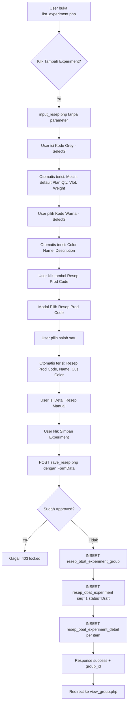

### Query Penting di `save_resep.php`

```sql
-- Insert group
INSERT INTO dbo.resep_obat_experiment_group
  (soi, no_cp, kode_grey, mesin, kode_warna, color_name, color_desc,
   resep_prod_code, resep_prod_name, cus_color, proint_resephdid,
   group_status, created_at, created_by)
VALUES (?, ?, ?, ?, ?, ?, ?, ?, ?, ?, ?, 'Draft', GETDATE(), ?);

-- Insert experiment
INSERT INTO dbo.resep_obat_experiment
  (group_id, experiment_seq, experiment_status, experiment_note, kode_grey, ...,
   created_at, created_by)
VALUES (?, 1, 'Draft', ?, ?, ..., GETDATE(), ?);

-- Insert details (loop)
INSERT INTO dbo.resep_obat_experiment_detail
  (id_resep_experiment, kode, name, category, receipe, uom, cf, uom_cf,
   std_price, total, is_manual, price_satuan, price_source,
   created_at, created_by)
VALUES (?, ?, ?, ?, ?, ?, ?, ?, ?, ?, 1, ?, ?, GETDATE(), ?);
```

---

## 4. Alur Buat Experiment Berikutnya

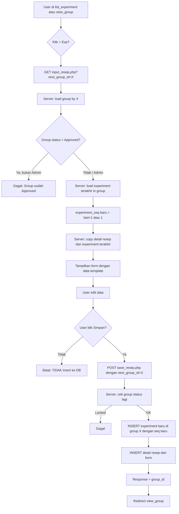

### Catatan Penting

- **Tidak ada insert draft** saat halaman dibuka. Template disimpan hanya di memory PHP session/request.
- Bila user menutup halaman / klik "Kembali", database tidak berubah.
- `experiment_seq` baru dihitung dari `MAX(experiment_seq) WHERE group_id = X + 1`.
- Bila `next_group_id` group sudah Approved, hanya Administrator yang boleh lanjut.

---

## 5. Alur Edit Experiment

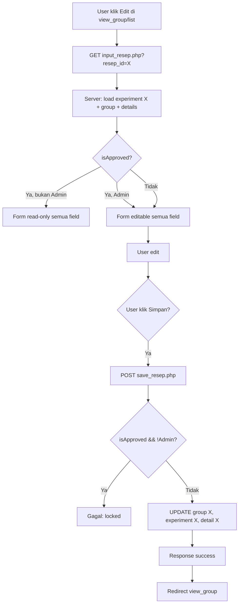

### Catatan

- Dropdown Status **tidak** menampilkan pilihan `Approved`.
- Status `Approved` hanya lewat tombol Approve.
- User biasa tidak bisa update status ke Approved lewat form.

---

## 6. Alur Approve Experiment

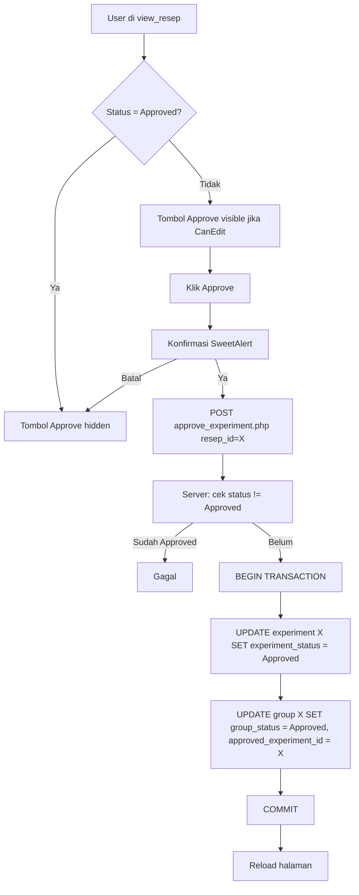

### Query

```sql
BEGIN TRAN;
UPDATE dbo.resep_obat_experiment
   SET experiment_status = 'Approved', updated_at = GETDATE(), updated_by = ?
 WHERE id = ?;
UPDATE dbo.resep_obat_experiment_group
   SET group_status = 'Approved',
       approved_experiment_id = ?,
       updated_at = GETDATE(), updated_by = ?
 WHERE id = ?;
COMMIT;
```

### Efek

- `experiment_status` = `Approved`.
- `group_status` = `Approved`.
- `approved_experiment_id` di group terisi experiment ini.
- Form Edit jadi read-only untuk user biasa.
- Tombol Delete experiment/group di-hide untuk user biasa.
- Tombol "+ Exp" di-hide untuk user biasa.

---

## 7. Alur Input Parameter Mesin Lab

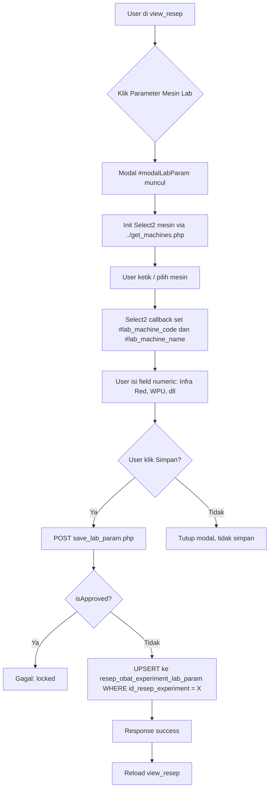

### Tabel & Field

```sql
CREATE TABLE dbo.resep_obat_experiment_lab_param (
  id INT IDENTITY PRIMARY KEY,
  id_resep_experiment INT NOT NULL,
  machine_code VARCHAR(50),
  machine_name VARCHAR(200),
  infra_red DECIMAL(10,2),
  tekanan_padder DECIMAL(10,2),
  wpu DECIMAL(10,2),
  speed DECIMAL(10,2),
  fan1 DECIMAL(10,2),
  fan2 DECIMAL(10,2),
  temp_chamber_1 DECIMAL(10,2),
  temp_chamber_2 DECIMAL(10,2),
  lainnya NVARCHAR(MAX),
  created_at DATETIME,
  created_by VARCHAR(50),
  updated_at DATETIME,
  updated_by VARCHAR(50),
  CONSTRAINT FK_lab_param_experiment FOREIGN KEY (id_resep_experiment)
    REFERENCES dbo.resep_obat_experiment(id) ON DELETE CASCADE
);
```

### Source Mesin

`../get_machines.php` query ke `famaster` (koneksi3) dengan filter `facode LIKE 'FAM%'`. Response Select2 format:

```json
{
  "results": [
    { "id": "FAM0054", "text": "BAKAR BULU-2 (FAM0054)", "facode": "FAM0054", "faname": "BAKAR BULU-2" }
  ]
}
```

### Tampilan Ringkasan

```text
Mesin            : BAKAR BULU-2 (FAM0054)
Infra Red | Tekanan      | WPU
          | Padder       |
Speed     | Fan1         | Fan2
Temp      | Temp         |
Chamber 1 | Chamber 2    |
Lainnya   : ...
```

---

## 8. Alur Input Lab Data

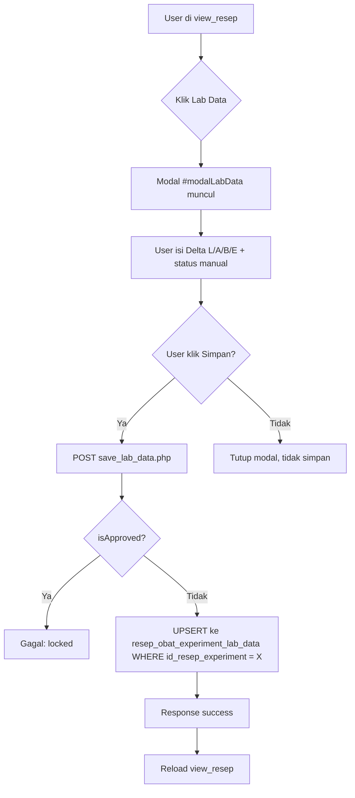

### Tabel & Field

```sql
CREATE TABLE dbo.resep_obat_experiment_lab_data (
  id INT IDENTITY PRIMARY KEY,
  id_resep_experiment INT NOT NULL,
  delta_l DECIMAL(10,4),
  delta_a DECIMAL(10,4),
  delta_b DECIMAL(10,4),
  delta_e DECIMAL(10,4),
  status VARCHAR(20), -- Sukses/Gagal (manual, tidak auto)
  created_at DATETIME,
  created_by VARCHAR(50),
  updated_at DATETIME,
  updated_by VARCHAR(50),
  CONSTRAINT FK_lab_data_experiment FOREIGN KEY (id_resep_experiment)
    REFERENCES dbo.resep_obat_experiment(id) ON DELETE CASCADE
);
```

### Catatan

- Status `Sukses` / `Gagal` di tabel ini **tidak** mengubah `experiment_status` di `resep_obat_experiment`. User tetap harus update status lewat form Edit.
- Delta E **tidak** dihitung otomatis. User input manual (atau bisa dihitung di client-side nanti).

---

## 9. Alur Delete Experiment

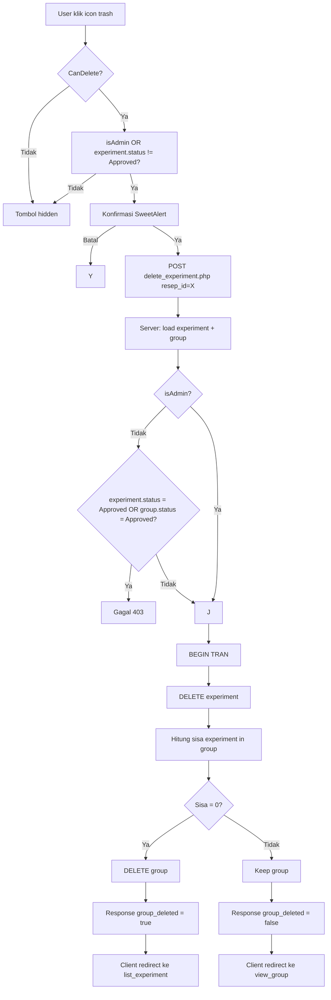

### Cascading Delete

Foreign key `id_resep_experiment` di `resep_obat_experiment_detail`, `resep_obat_experiment_lab_param`, `resep_obat_experiment_lab_data` semua pakai `ON DELETE CASCADE`. Jadi sekali experiment dihapus, child rows otomatis terhapus.

---

## 10. Alur Delete Group

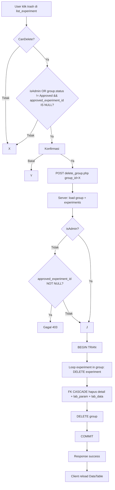

---

## 11. Alur Tampilan Info Group

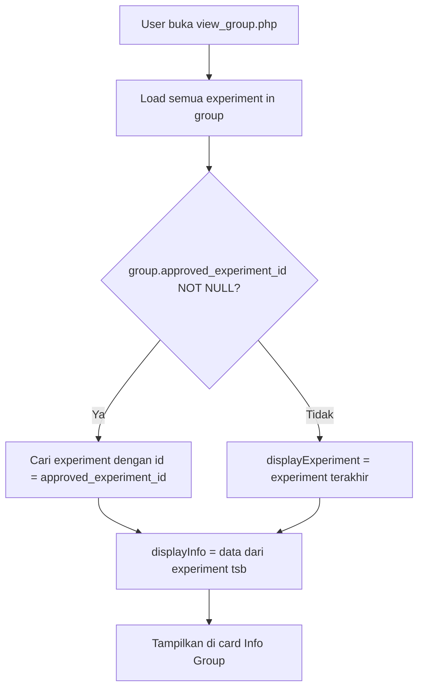

### Invarian

- `Info Group` di `view_group.php` **selalu menampilkan data dari experiment yang sudah di-approve**, kalau ada.
- Bila belum ada approved, tampilkan experiment **terbaru** (urut `experiment_seq` descending).
- Hal ini menjamin konsistensi: Info Group merefleksikan experiment final yang dipakai.

---

## 12. State Diagram Status

### Experiment

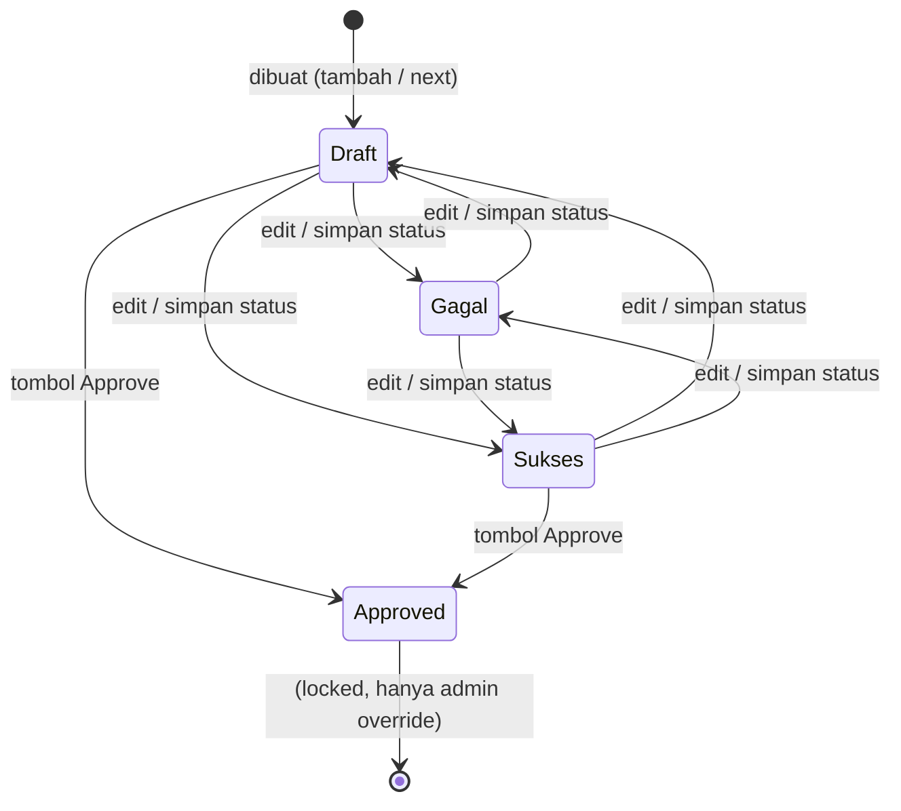

### Group

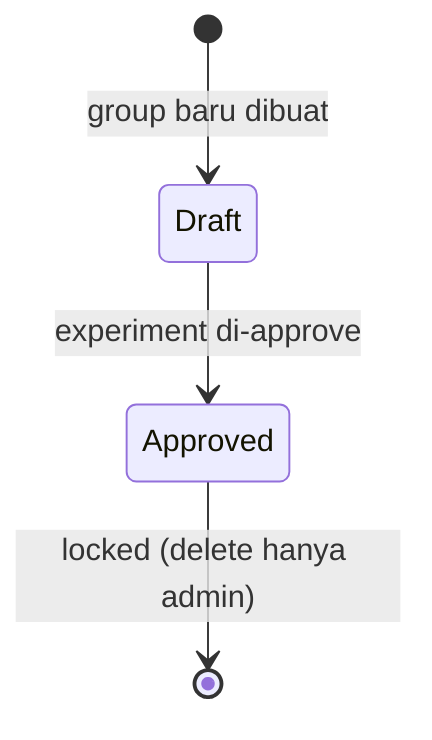

---

## 13. Skema Database

```text
resep_obat_experiment_group
  id PK
  soi
  no_cp
  kode_grey
  mesin
  kode_warna
  color_name
  color_desc
  resep_prod_code
  resep_prod_name
  cus_color
  proint_resephdid        -- pointer ke proint untuk referensi
  group_status            -- Draft / Approved
  approved_experiment_id  -- FK ke resep_obat_experiment.id
  created_at, created_by
  updated_at, updated_by

resep_obat_experiment
  id PK
  group_id FK
  experiment_seq
  experiment_status       -- Draft / Gagal / Sukses / Approved
  experiment_note
  kode_grey, mesin, kode_warna, color_name, color_desc,
  resep_prod_code, resep_prod_name, cus_color, proint_resephdid,
  lot_no, weight, plan_qty, vlot
  created_at, created_by
  updated_at, updated_by

resep_obat_experiment_detail
  id PK
  id_resep_experiment FK  -- CASCADE
  kode, name, category
  receipe, uom, cf, uom_cf
  std_price, total
  is_manual               -- 1 = manual
  price_satuan, price_source
  created_at, created_by
  updated_at, updated_by

resep_obat_experiment_lab_param
  id PK
  id_resep_experiment FK UNIQUE -- CASCADE
  machine_code, machine_name
  infra_red, tekanan_padder, wpu, speed, fan1, fan2
  temp_chamber_1, temp_chamber_2, lainnya
  created_at, created_by
  updated_at, updated_by

resep_obat_experiment_lab_data
  id PK
  id_resep_experiment FK UNIQUE -- CASCADE
  delta_l, delta_a, delta_b, delta_e
  status (Sukses/Gagal manual)
  created_at, created_by
  updated_at, updated_by
```

### Relasi

```text
resep_obat_experiment_group 1 --- N resep_obat_experiment
resep_obat_experiment 1 --- 1 resep_obat_experiment_lab_param
resep_obat_experiment 1 --- 1 resep_obat_experiment_lab_data
resep_obat_experiment 1 --- N resep_obat_experiment_detail
resep_obat_experiment_group.approved_experiment_id --- 1 resep_obat_experiment.id
```

---

## 14. Aturan Permission

| Aksi | User Biasa | Administrator (GroupId=1) |
| --- | --- | --- |
| Lihat halaman | Butuh `CanView` | Butuh `CanView` |
| Tambah Group / Exp | Butuh `CanAdd` | Butuh `CanAdd` |
| Tambah Exp pada Group Approved | ❌ | ✅ (override) |
| Edit Experiment Draft/Gagal/Sukses | Butuh `CanEdit` | Butuh `CanEdit` |
| Edit Experiment Approved | ❌ | ✅ (override) |
| Delete Experiment Draft/Gagal/Sukses | Butuh `CanDelete` | Butuh `CanDelete` |
| Delete Experiment Approved | ❌ | ✅ (override) |
| Delete Group Draft | Butuh `CanDelete` | Butuh `CanDelete` |
| Delete Group Approved | ❌ | ✅ (override) |
| Approve Experiment | Butuh `CanEdit` | Butuh `CanEdit` |
| Input Lab Param / Data | User dengan `CanEdit` | Sama |
| Set Status ke Approved via form | ❌ (tidak ada di dropdown) | ❌ (tidak ada di dropdown) |

---

## 15. Edge Cases & Invarian

### Invarian

1. **1 group minimal 0 experiment**. Bila 0 experiment, group tidak ada artinya (biasanya langsung dibuat bersama experiment pertama).
2. **`experiment_seq` dalam 1 group harus unik dan urut 1, 2, 3, ...** tanpa gap.
3. **1 experiment hanya boleh punya 1 row** di `resep_obat_experiment_lab_param` dan `resep_obat_experiment_lab_data`. (Unique constraint di `id_resep_experiment`).
4. **`approved_experiment_id` di group harus valid** (merujuk ke experiment yang ada di group tsb). Foreign key constraint recommended.
5. **`group_status = Approved` iff `approved_experiment_id IS NOT NULL`**.
6. **Setelah approve, `experiment_status` harus `Approved`**.
7. **Total Cost / Meter** = `grand_total / plan_qty` (handle `plan_qty = 0` dengan return 0).
8. **Info Group** = data experiment approved (kalau ada) atau experiment terbaru.
9. **Status `Approved` TIDAK BISA di-set lewat form edit** (dropdown only Draft/Gagal/Sukses). Hanya lewat tombol Approve.

### Edge Cases yang ditangani

- **Batal "Buat Experiment Berikutnya"**: data template tidak tersimpan. ✅
- **Reload halaman "Buat Experiment Berikutnya"**: request ulang, tidak ada efek samping DB. ✅
- **Edit experiment approved oleh user biasa**: form read-only, tidak bisa save. ✅
- **Edit experiment approved oleh admin**: form editable, save berhasil. ✅
- **Delete experiment approved oleh user biasa**: tombol hidden. ✅
- **Delete experiment terakhir**: group ikut terhapus. ✅
- **Delete group approved**: tombol hidden untuk user biasa. ✅
- **Plan Qty = 0**: Total Cost / Meter tampil `Rp 0,00` (tidak divide by zero). ✅
- **Group tanpa approved_experiment_id**: status = "Draft" sampai experiment di-approve. ✅
- **Input lab param/data pada experiment approved**: form read-only, modal Simpan disabled. ✅
- **Select2 mesin di dalam modal**: pakai `dropdownParent: $('#modalLabParam')` agar dropdown tidak tertutup. ✅

### Edge Cases yang perlu monitoring

- **Concurrent edit** 2 user pada experiment yang sama: tidak ada locking. Last-write-wins.
- **Koneksi terputus saat simpan**: transaction rollback di SQL Server, tidak ada partial data.
- **Mesin tidak ditemukan di famaster**: Select2 empty state, user tidak bisa pilih.
- **Resep Prod Code tidak punya codeprod**: harga di detail resep kosong (`std_price = 0`).
